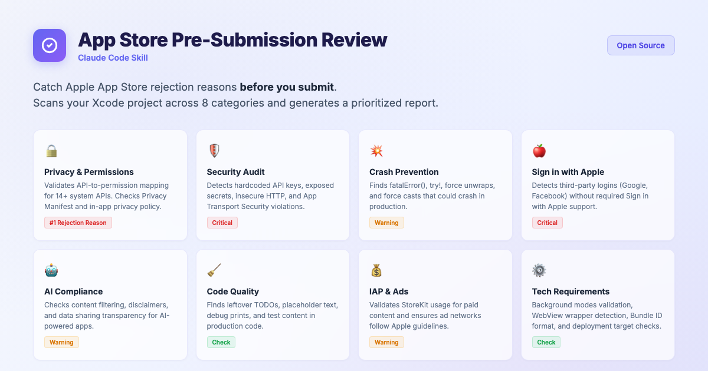

# App Store Review - Claude Code Skill



A comprehensive pre-submission code review skill for iOS/macOS apps. It scans your Xcode project and catches potential App Store rejection reasons **before** you submit.

## What It Does

Run `/app-store-review` in [Claude Code](https://docs.anthropic.com/en/docs/claude-code) and it will automatically scan your Xcode project for issues that commonly cause App Store rejections.

## Checks Performed

| Category | What It Catches |
|----------|----------------|
| **Privacy & Permissions** | Missing usage descriptions, unused permissions, vague permission text, missing Privacy Manifest |
| **Account Management** | Missing account deletion option, missing in-app privacy policy |
| **Code Quality** | Leftover TODO/FIXME comments, placeholder text, debug prints |
| **Crash Risks** | `fatalError()`, `try!`, force unwraps, force casts |
| **Security** | Hardcoded API keys, exposed secrets, insecure HTTP connections, ATS violations |
| **Sign in with Apple** | Third-party login without Sign in with Apple |
| **AI Compliance** | Missing content filters, missing disclaimers for AI-generated content |
| **In-App Purchases** | Paid digital content without StoreKit |
| **Technical Requirements** | Unused background modes, WebView-only apps, deployment target conflicts |
| **App Icons** | Missing 1024x1024 icon and other required sizes |

## Installation

### Option 1: Install via Claude Code CLI

```bash
claude install-skill https://github.com/Almatrafi-Ali/app-store-review-skill
```

### Option 2: Manual Installation

1. Create the skill directory:
   ```bash
   mkdir -p ~/.claude/skills/app-store-review
   ```
2. Copy `SKILL.md` into that directory.

## Usage

Open your Xcode project directory in Claude Code, then run:

```
/app-store-review
```

The skill will:
1. Discover your `.xcodeproj`, `.swift` files, `Info.plist`, entitlements, and privacy manifest
2. Run all checks across 8 categories
3. Generate a detailed report with findings prioritized by severity

## Report Format

The report includes:
- **Project Info** - Bundle ID, deployment target, scan date
- **Overall Status** - Ready / Needs Changes / Not Ready
- **Detailed Findings** - Organized by category with file names and line numbers
- **Action Items** - Prioritized list of required fixes with code solutions

## Example

```
/app-store-review
```

Output:
```
# 📋 App Store Code Review Report

## Project Info
- Project: MyApp
- Bundle ID: com.example.myapp
- Deployment Target: iOS 16.0

## Result: Needs Changes ⚠️

| | Count |
|--|-------|
| ✅ Passed | 12 |
| ⚠️ Warning | 3 |
| ❌ Critical | 1 |

## ❌ Critical: Missing NSCameraUsageDescription
File: CameraView.swift:24
Uses AVCaptureSession but no camera permission key found.
Fix: Add INFOPLIST_KEY_NSCameraUsageDescription to build settings.
```

## Requirements

- [Claude Code](https://docs.anthropic.com/en/docs/claude-code) CLI or Desktop app
- An Xcode project (`.xcodeproj`)

## License

MIT
